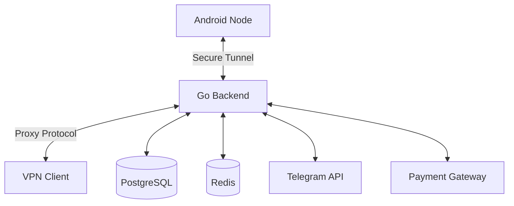

# Traffix Node Architecture

This document provides a high-level overview of the Traffix Node technical architecture.

## System Overview

The system consists of three main components:
1.  **Node Operators (Android App):** Users who share their internet bandwidth.
2.  **Clients (VPN Users):** Users who consume bandwidth for privacy or data collection.
3.  **Core Backend (Orchestrator):** The central server governing the network.

## 1. The Mobile Node (Android)

*   **Background Service:** Runs a persistent foreground service to keep the connection alive even when the app is minimized.
*   **Tunneling:** Establishes a WebSocket-based secure tunnel to the backend.
*   **Keep-Alive:** Sends periodic heartbeats to prove uptime and availability.
*   **Resource Management:** Monitors battery and data usage to protect the user's device.

## 2. The Backend (Golang)

The backend is built as a modular monolith to ensure low latency and simplified deployment.

### Key Modules:

*   **Tunnel Manager:** Handles incoming WebSocket connections from Nodes. Maps virtual IP addresses to active WebSocket sessions.
*   **Proxy Handler:** Accepts SOCKS5/HTTP requests from Clients and routes them through the appropriate Node tunnel.
*   **Billing Engine:** Real-time traffic accounting. Deducts balance from Clients and credits Node Operators (minus platform fee).
*   **Quality Watchdog:** Monitors node latency and IP quality score (IPQS). Automatically flags or bans nodes with poor connectivity.

## 3. Database Schema

We use **PostgreSQL** for persistent data:

*   `users`: User identity (linked to Telegram ID).
*   `devices`: Registered Android nodes.
*   `sessions`: Active connectivity sessions.
*   `billing_history`: Immutable ledger of all transactions.
*   `audit_log`: Security and action logs.

**Redis** is used for:
*   Real-time bandwidth counters.
*   Session state (Online/Offline).
*   Rate limiting.

## 4. Security

*   **Traffic Encryption:** All data between Node and Server is encrypted via TLS 1.3.
*   **Authentication:** JWT (JSON Web Tokens) with short expiration and refresh tokens.
*   **Challenge-Response:** The server periodically challenges Nodes to prove they are legitimate Android devices (not emulators).
